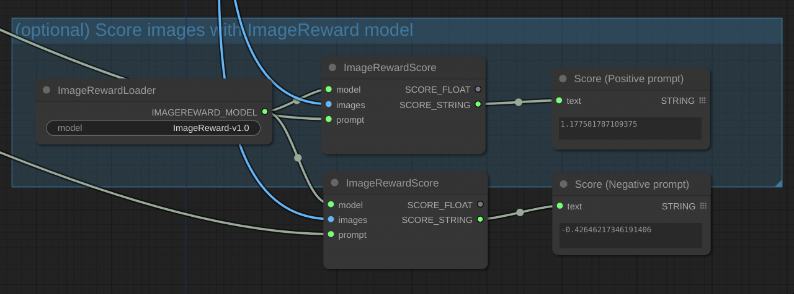

# ComfyUI-ImageReward

Score images with [ImageReward](https://github.com/THUDM/ImageReward).

## Installation

Within your ComfyUI directory, and within your Python venv:

```sh
cd custom_nodes
git clone https://github.com/ZaneA/ComfyUI-ImageReward
pip install -r ComfyUI-ImageReward/requirements.txt
```

## Usage

Add an `ImageRewardLoader` node, this has the default model name prefilled, and is passed directly to the ImageReward loader. Note, the model will be downloaded on first run.

Add an `ImageRewardScore` node, connect the model, your image, and your prompt (either enter this directly, or right click the node and convert prompt to an input first). Connect the `SCORE_FLOAT` or `SCORE_STRING` output to an appropriate node.


